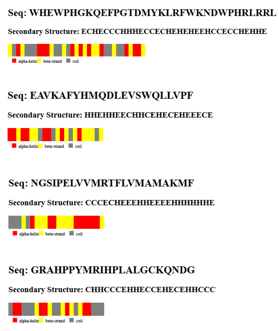

# Protein Management and Visualization API

## Overview

This project provides a RESTful API for managing protein data, allowing users to perform CRUD (Create, Read, Update, Delete) operations on protein information. The API also generates SVG visualizations of predicted secondary structures for each protein based on its sequence.

## Features

- **Manage Protein Data**: Create, retrieve, update, and delete protein entries.
- **SVG Generation**: Generate SVG files representing the predicted secondary structure of proteins.
- **Data Persistence**: Store protein data and SVG files in AWS S3 for durability and accessibility.

## Technologies Used

- **Node.js**: Backend server environment.
- **Express.js**: Web framework for building the API.
- **AWS SDK**: For interacting with AWS S3 for file storage.
- **Postman**: For testing API endpoints.
- **SVG**: For visualizing protein secondary structures.

## Getting Started

### Prerequisites

- Node.js (v14 or higher)
- npm (Node Package Manager)
- AWS Account (for S3)
- Postman (for testing)

### Sample SVGs

